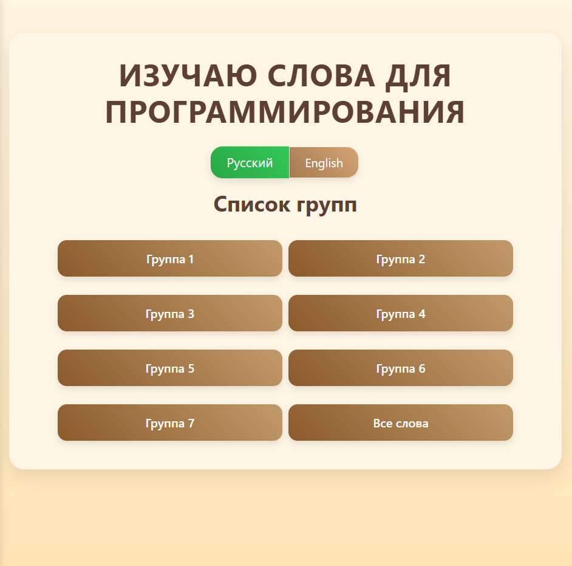
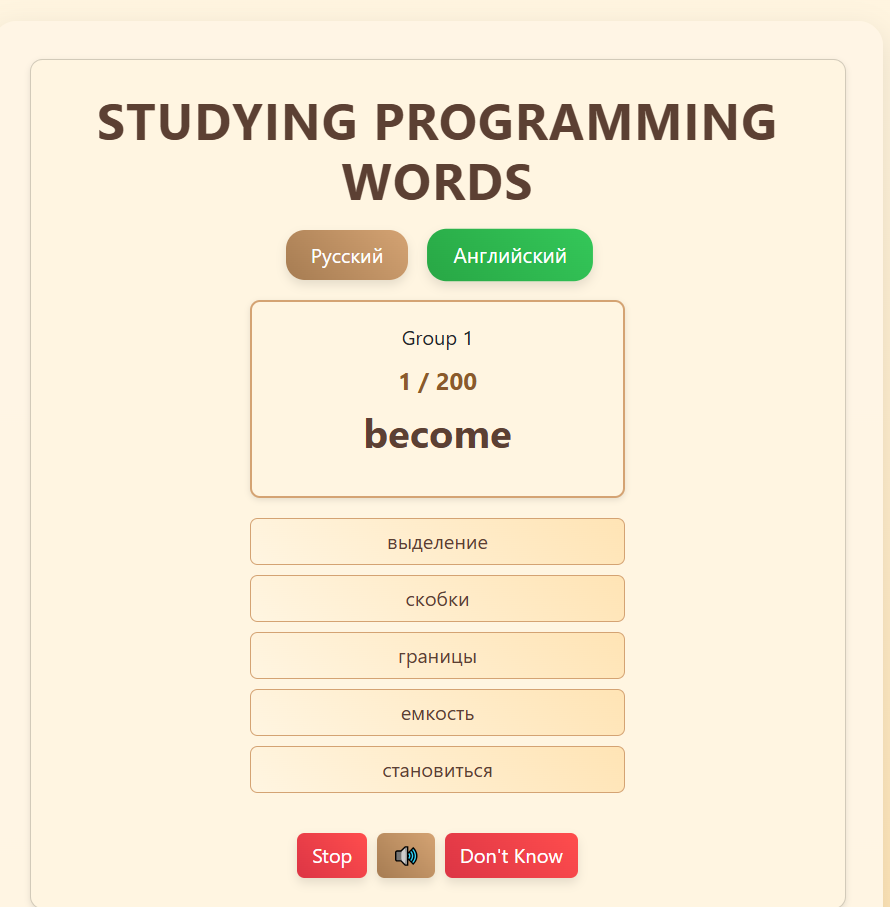
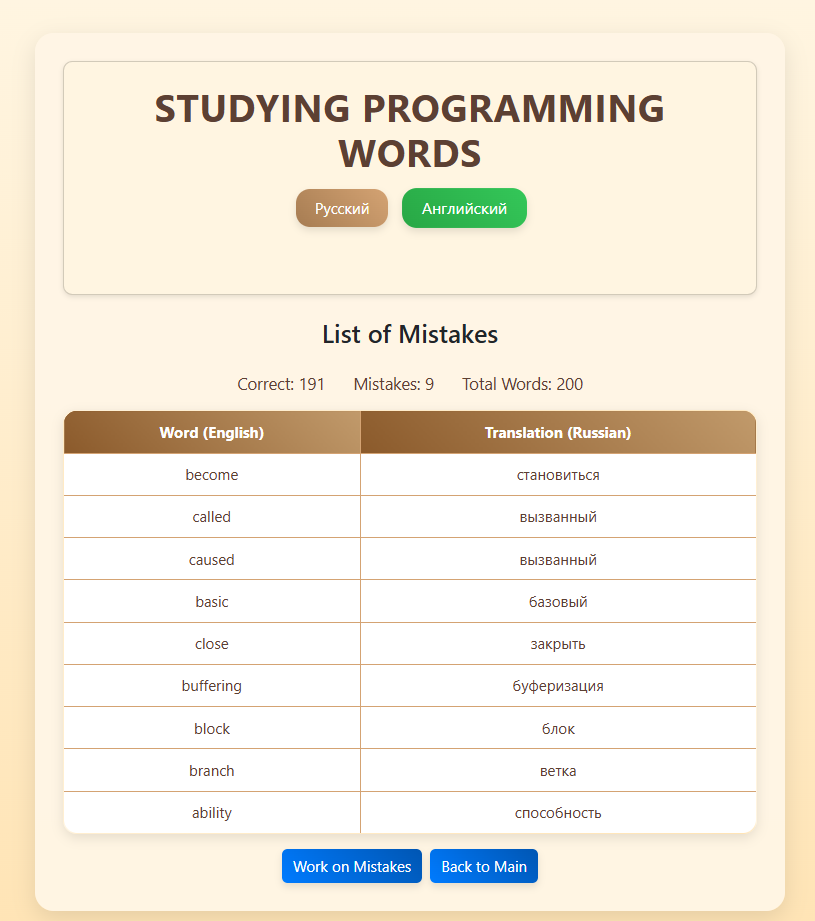

Programming Words
Веб-приложение для изучения программистских терминов на русском и английском языках через интерактивный тест.

Ссылка
Programming Words

Как использовать
Выбери группу слов на главной странице.
Проходи тест, выбирая правильный перевод.
Пройди до конца или нажми "Стоп", чтобы увидеть результаты.
Используй "Работа над ошибками", чтобы повторить слова, где ошибся.
Переключай язык (русский/английский) в любой момент.

Технологии
HTML5, 
CSS3 (Bootstrap)
JavaScript (ES6+, ES-модули)
Web Speech API
localStorage

Установка локально
git clone https://github.com/Oxana6808/VocabularyTest.git

Или протестируй онлайн:
https://oxana6808.github.io/VocabularyTest/

Скриншоты

Главная

Тест:

Результат тестирования:

